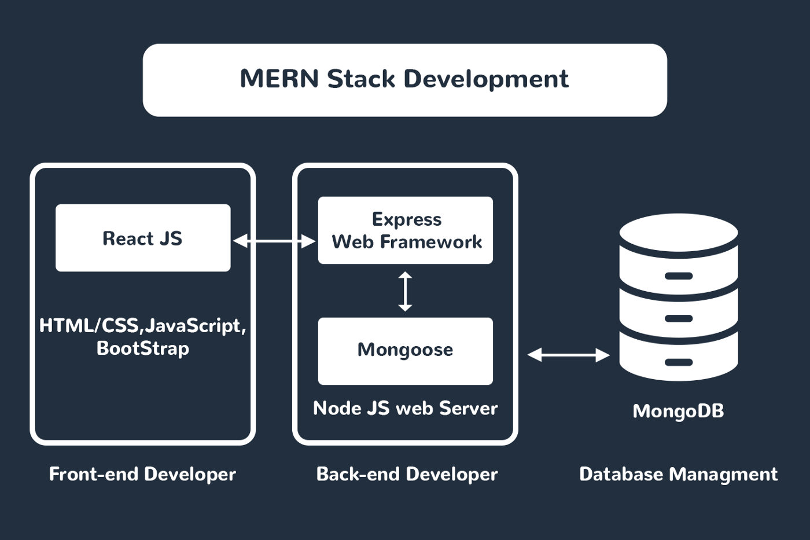

# Welcome to JavaScript!

## Introduction
Welcome to the stack formerly known as **MERN**! In this stack, we'll be building full-stack applications in JavaScript using **MongoDB**, **Express.js**, **React**, and **Node.js**, hence the acronym.

React will be our front-end solution, MongoDB will be our database, and Express will be our server framework for Node. This full stack represents your first *"JavaScript Everywhere"* paradigm, unifying web application development around a single programming language, rather than different languages for server-side and client-side scripts.

As you'll see, each of these technologies are fairly unopinionated -- you'll have a lot of freedom when building applications. If you searched "how to build an express api" on Google, your first ten hits will likely present ten different solutions. Of course, we'll teach you one way to do it, but keep in mind that the possibilities are endless. Explore your style. Figure out who you are as a coder!

## Overview
1. JavaScript
   1. Intro to Node
   2. JavaScript ES6 Fundamentals
   3. JavaScript OOP
   4. Functional Programming
   5. NPM
2. React
   1. Intro to React
   2. Class Components
   3. Functional Components
   4. APIs
   5. React Routing
3. Express
4. MongoDB and Mongoose
5. Full Stack MERN