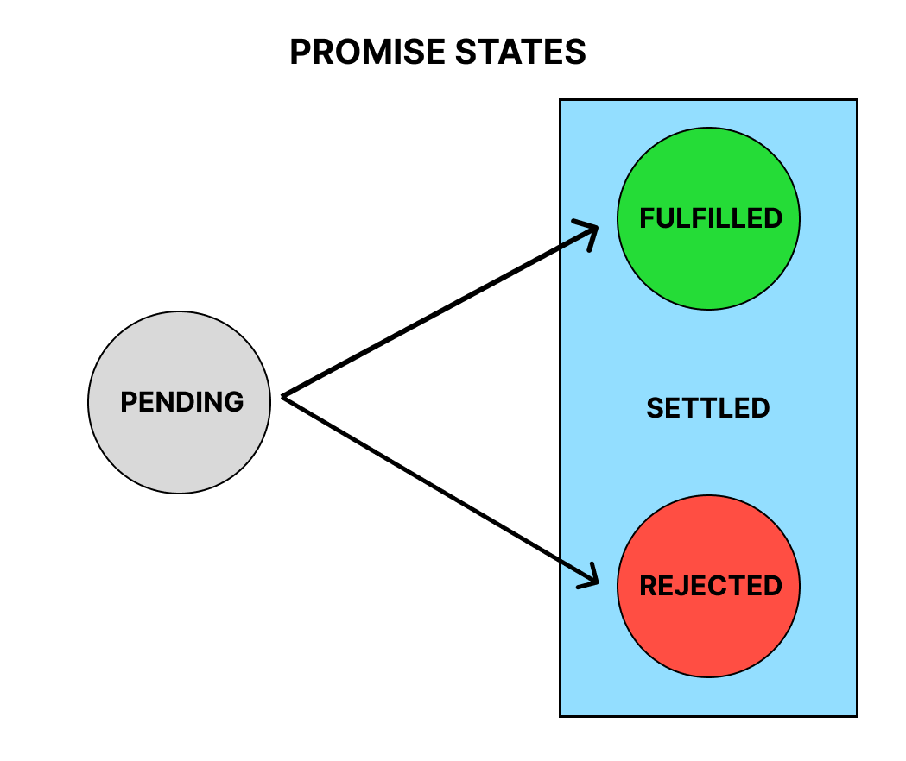

# Promises

Often, as web developers, we write code that takes some time to execute and we don't want our applications to grind to a halt while they do their job. We fetch data from external API's or perform CRUD operations in a database.

Prior to ES6, callbacks were the best solution we had when solving these problems, but there were a lot of challenges with that approach. You may have heard of "callback hell," messy spaghetti code in which callbacks that were dependent on other callbacks were nested deeper and deeper into each other.

In ES6, Promises became a part of JavaScript. They are a much cleaner and more elegant way to deal with asynchronous operations. A Promise is just what it sounds like—a promise to deliver a result.

Although we won't be creating Promises much in this stack,we will be using the Fetch API and the Axios library, both of which return Promises. We should know how to create a simple Promise.

A promise is a JavaScript object instantiated with the `new Promise()` constructor. A function is passed to the constructor called the *executor*, and it contains what's called *producing code*—typically some asynchronous operation.

## Producer

```js
const myPromise = new Promise((resolve, reject) => {
    // executor (producing code
    // that takes some time to complete)
    // eventually produces some result
});
```

When the executor obtains the result, it should call one of these callbacks:

- `resolve(value)` — if the job is finished successfully, with the resulting value.
- `reject(error)` — if an error has occurred, error is the error object.

When the executor is finished with the attempt, it calls `resolve` if it was successful or `reject` if there was an error.

The promise object returned by the `new Promise()` constructor has two properties:

- state — initially "pending", then changes to either "fulfilled" when `resolve` is called or "rejected" when `reject` is called.
- result — initially undefined, then changes to value when `resolve(value)` is called or error when `reject(error)` is called.

So the executor eventually moves the Promise to one of these states:



## Consumer

Once we have created a Promise object, we have to learn how to handle a resolution or rejection. A consumer function should get notified once a producer's task is settled.

We have three handler methods for use in a consumer function:

- `.then()` - handles the resulting value when the Promise's state is fulfilled.
- `.catch()` - handles the resulting error when the Promise's state is rejected.
- `finally()` - handles any cleanup, like stopping a loader. If used, it runs irrespective of resolution or rejection.

A Promise object serves as a link between the executor (the "producing code") and the consuming functions which will receive the result or error. Consuming functions can receive a value or an error by using the methods `.then` and `.catch`.

```js
let loading = true;
loading && console.log('Loading...');

myPromise.finally(() => {
    loading = false;
    console.log(`Promise settled`);
}).then((result) => {
    console.log(result);
}).catch((error) => {
    console.log(error);
});
```

### "Producing code" is code that can take some time.

### "Consuming code" is code that must wait for the result.

### A Promise is a JavaScript object that links producing code and consuming code.