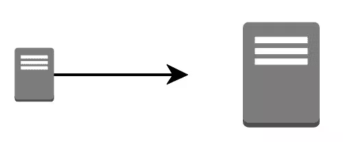
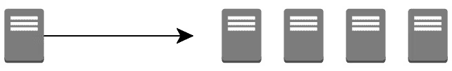

# MongoDB

MongoDB is an open-source, schema-optional, NoSQL document-oriented database solution. NoSQL stands for "Not only SQL". NoSQL databases are non-tabular, and store data differently than relational tables like MySQL tables. MongoDB stores its data in JSON-like objects.

```json
{
   "_id": "57b468d9-e823-432f-bcca-7c8b5f407a5a",
   "firstName": "Narciso",
   "lastName": "Lobo",
   "email": "nlobo@codingdojo.com",
   "location": "Los Angeles"
}
```

## Brief history of NoSQL databases

NoSQL databases emerged in the late 2000s as the cost of storage dramatically decreased. Developers (rather than storage) were becoming the primary cost of software development, so NoSQL databases optimized for developer productivity.

As storage costs decreased, the amount of data that applications needed to store and query increased. Defining the schema in advance became more and more difficult to predict. NoSQL databases allow developers to store huge amounts of unstructured data, giving them a lot of flexibility.

Also, Agile software development was rising in popularity. Developers needed to rapidly adapt to changing requirements. NoSQL databases gave them this flexibility.

## NoSQL database features

### Flexible Schemas

- Flexible schemas - Unlike SQL databases, where you must determine and declare a table's schema before inserting data, MongoDB's collections, by default, do not require their documents to share the same schema. That is:
  - The documents in a single collection do not need to have the same set of fields and the data type for a field can differ across documents within a collection.

In practice, however, the documents in a collection share a similar structure, and you can enforce document validation rules for a collection during update and insert operations.

### Horizontal Scaling


Vertical scaling refers to increasing the processing power of a single server or cluster. Both relational and non-relational databases can scale up, but eventually, there will be a limit in terms of maximum processing power and throughput. Additionally, there are increased costs with scaling up to high-performing hardware, as costs do not scale linearly.


Horizontal scaling, also known as scale-out, refers to bringing on additional nodes to share the load. This is difficult with relational databases due to the difficulty in spreading out related data across nodes. With non-relational databases, this is made simpler since collections are self-contained and not coupled relationally. This allows them to be distributed across nodes more simply, as queries do not have to “join” them together across nodes.

### Fast Queries

MongoDB allows related data to be embedded within a single document.

Embedded documents capture relationships between data by storing related data in a single document structure. MongoDB documents make it possible to embed document structures in a field or array within a document. These de-normalized data models allow applications to retrieve and manipulate related data in a single database operation. No slow expensive joins.

```json
{
    "_id": "57b468d9-e823-432f-bcca-7c8b5f407a5a",
    "firstName": "Narciso",
    "lastName": "Lobo",
    "contact": {
        "email": "nlobo@codingdojo.com",
        "phone": "(555) 456-7890"
    }
    "location": "Los Angeles",
    "hobbies": [
        "ukulele", "comic books", "cooking"
    ]
}
```

In general, embedding provides better performance for read operations, as well as the ability to request and retrieve related data in a single database operation. Embedded data models make it possible to update related data in a single atomic write operation.

### Ease of Use for Developers

MongoDB is built on a scale-out architecture that has become popular with developers of all kinds for developing scalable applications with evolving data schemas.

As a document database, MongoDB makes it easy for developers to store structured or unstructured data. It uses a JSON-like format to store documents. This format directly maps to native objects in most modern programming languages, making it a natural choice for developers, as they don’t need to think about normalizing data. MongoDB can also handle high volume and can scale both vertically or horizontally to accommodate large data loads.

MongoDB was built for people building internet and business applications who need to evolve quickly and scale elegantly. Companies and development teams of all sizes use MongoDB for a wide variety of reasons.